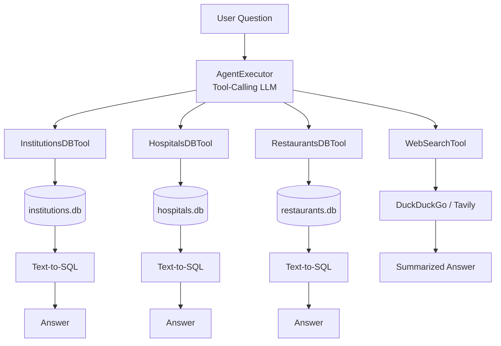

# Bangladesh Multi-Tool AI Agent

A small LangChain agent that answers questions about Bangladesh by picking
the right tool for the job: three local SQLite databases for structured
facts (institutions, hospitals, restaurants), and a web search tool for
everything else.

## Try it on Colab:

[](https://colab.research.google.com/drive/1KalXktn2_DuI_l25qmHL59BCJYWnxZZ7?usp=sharing)

## Overview

Ask it "how many hospitals are in Dhaka?" and it hits a SQLite database.
Ask it "what is the healthcare policy of Bangladesh?" and it goes to the
web instead. The agent decides which tool to use per question — you don't
have to tell it.



Each database tool works the same way under the hood: it shows the model
the table's schema plus a couple of example question → SQL pairs, the
model writes one `SELECT` query, that query runs against SQLite, and the
model turns the raw rows into a normal sentence instead of dumping a table
at you.

## 1. Setup Instructions

```bash
git clone https://github.com/MehdiHossenFahim/Bangladesh-Multi-Tool-AI-Agent.git
cd Bangladesh-Multi-Tool-AI-Agent
pip install -r requirements.txt
cp .env.example .env
```

### Create Virtual Environment

```bash
python -m venv .venv
# activate it
source .venv/Scripts/activate    # Git Bash on Windows
# .venv\Scripts\activate.bat     # cmd.exe
# .venv\Scripts\Activate.ps1     # PowerShell
# source .venv/bin/activate      # macOS/Linux

python --version   # Use python 3.11, 3.12 or 3.13
```

Now open `.env` and add one LLM key. None of the defaults here need a
credit card:

| `LLM_PROVIDER=`  | Cost               | Card needed?     | Get a key                                       |
| ---------------- | ------------------ | ---------------- | ----------------------------------------------- |
| `groq` (default) | Free               | No               | https://console.groq.com/keys                   |
| `gemini`         | Free               | No               | https://aistudio.google.com/apikey              |
| `ollama`         | Free, runs locally | No signup at all | https://ollama.com, then `ollama pull llama3.1` |
| `anthropic`      | Paid               | Usually          | https://console.anthropic.com                   |
| `openai`         | Paid               | Usually          | https://platform.openai.com                     |

Groq is the default because getting a key takes about a minute and
responses come back fast. If you'd rather not sign up for anything, use
`ollama` — everything runs on your own machine.

`WebSearchTool` doesn't need a key at all by default — it uses DuckDuckGo.
`TAVILY_API_KEY` is there if you want better search results and don't
mind making a Tavily account (also free).

## 2. Build the databases

The repo comes with a small sample of real rows from all three datasets,
so you can try everything without downloading anything:

```bash
python scripts/build_databases.py --source sample
```

When you want the full datasets (roughly 34.9k institutions, 38.9k
hospitals/health facilities, 12.7k restaurants):

```bash
python scripts/download_datasets.py
python scripts/build_databases.py --source raw
```

Either way you end up with:

```
data/db/institutions.db   -> table: institutions
data/db/hospitals.db      -> table: hospitals
data/db/restaurants.db    -> table: restaurants
```

## 3. Run it

```bash
python agent.py                                     # interactive chat
python agent.py --query "How many hospitals are in Dhaka?"
```

## 4. Example queries

| Query                                                | Tool used          |
| ---------------------------------------------------- | ------------------ |
| List colleges in Dhaka district.                     | InstitutionsDBTool |
| How many government institutions are in Rajshahi?    | InstitutionsDBTool |
| How many hospitals are in Dhaka?                     | HospitalsDBTool    |
| Which medical college hospitals exist in Chattogram? | HospitalsDBTool    |
| Find restaurants in Chattogram serving biryani.      | RestaurantsDBTool  |
| What are the highest rated restaurants in Dhaka?     | RestaurantsDBTool  |
| What is the healthcare policy of Bangladesh?         | WebSearchTool      |
| What is the role of DGHS in Bangladesh?              | WebSearchTool      |

## 5. Project layout

```
bd-multitool-agent/
├── agent.py                    # builds & runs the agent (CLI entry point)
├── requirements.txt
├── .env.example
├── data/
│   ├── sample/                 # small bundled CSVs for offline testing
│   ├── raw/                    # full CSVs land here after download_datasets.py
│   └── db/                     # generated SQLite databases
├── scripts/
│   ├── download_datasets.py    # pulls the full CSVs from Hugging Face
│   └── build_databases.py      # turns CSVs into typed SQLite tables
├── tools/
│   ├── db_tool_base.py         # shared text-to-SQL engine
│   ├── institutions_tool.py
│   ├── hospitals_tool.py
│   ├── restaurants_tool.py
│   └── web_search_tool.py
└── notebooks/
    └── BD_MultiTool_AI_AGENT_colab
```

## 6. Notes about the data

A couple of things worth knowing before you assume the data can answer
more than it actually can:

- **Hospitals.** The source dataset (`Mahadih534/all-bangladeshi-hospitals`)
  is really a DGHS facility registry — name, type, agency, location. It
  does not have bed counts or doctor counts. If you ask for bed capacity,
  the agent will tell you it's not in the data rather than making up a
  number.
- **Restaurants.** There's no real cuisine field in
  `Mahadih534/Bangladeshi-Restaurant-Data`. The `cuisine_guess` column is
  a keyword match against the restaurant name (done once, at ingest time,
  in `build_databases.py`) — good enough to find "biryani places" but not
  something you'd cite.
- **Institutions.** Covers K-12/madrasah/college-level institutions
  registered with data.gov.bd, not a full list of public/private
  universities.

Every SQL query the agent generates is read-only — `INSERT`/`UPDATE`/
`DELETE`/`DROP`/etc. get rejected before they ever touch the database (see
`tools/db_tool_base.py`), and results are capped at 25 rows unless you're
asking for a count or other aggregate.

## 7. Swapping things out

- **LLM provider** — change `LLM_PROVIDER` in `.env` (`agent.py::build_llm`
  has the full list).
- **Web search** — set `TAVILY_API_KEY` to use Tavily instead of
  DuckDuckGo; add another branch in `tools/web_search_tool.py::_search` for
  SerpAPI, Bing, etc.
- **Full dataset** — re-run `scripts/build_databases.py --source raw`
  whenever you want to rebuild from the complete data after running
  `scripts/download_datasets.py`.

---

## Author

**Mehedi Hossen Fahim**.
